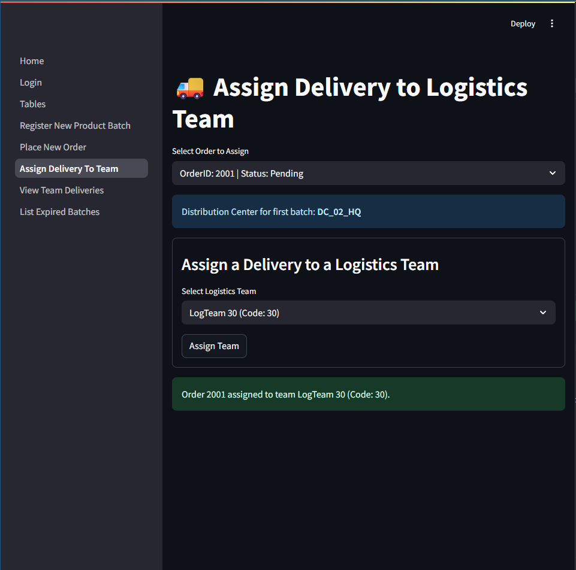

# MedTech Logistics
> Object-Relational Database implementation in Oracle 21c for Database Systems Exam @ Università degli Studi di Bari

## Project Overview

MedTech Logistics is a database system designed to manage logistics operations. The project utilizes **Oracle 21c** for object-relational database modeling and includes a demo web application built with **Streamlit** for interactive exploration.

## Getting Started

### Prerequisites

- [Docker](https://www.docker.com/get-started)
- [Python 3.12](https://www.python.org/downloads/)

### Launching the Database with Docker Compose

1. Clone the repository:
    ```bash
    git clone https://github.com/yourusername/medtech-logistics.git
    cd medtech-logistics
    ```
2. Start the Oracle 21c database:
    ```bash
    docker-compose up -d
    ```
3. Wait **a few minutes** for the database to initialize.

### Running the Streamlit Demo

1. Install Python dependencies:
    ```bash
    pip install -r requirements.txt
    ```
2. Launch the Streamlit app:
    ```bash
    streamlit run webapp/Home.py
    ```
3. Open your browser and go to the URL provided by Streamlit.

## Object-Relational Schema (Version 1)

Below is the first version of the object-relational schema for the MedTech Logistics database. This schema illustrates the initial design of entities, relationships, and object types used to model the logistics operations.

- Entity and relationship definitions
- Object types and inheritance structures
- Key constraints and associations

Refer to the diagram below for a visual representation.


## Object-Relational Schema (Version 2)

The second version of the schema reflects improvements and refinements based on feedback and implementation requirements. This is the schema currently implemented in the database.

- Enhanced and optimized relationships
- Updated object types and inheritance hierarchies
- Improved constraints and referential integrity

See the diagram below for the updated schema.


## Implemented Database Objects

### Object Types

The MedTech Logistics database uses Oracle object-relational features with the following custom types:

- `Location`: Represents a physical address (city, street, street number, zip code).
- `Product_t`: Represents a product with serial number, category, and expiry date.
- `PhoneList`: `VARRAY` of up to 3 phone numbers.
- `ContactInfo`: Stores phone numbers, email, and fax for contacts.
- `PreferencesList`: Nested table of product references for department supply preferences.
- `Department_t`: Represents a department with contact info and supply preferences.
- `DepartmentList`: Nested table of department references for customer affiliations.
- `Customer_t`: Represents a customer with a code, location, and affiliated departments.
- `TeamMember_t`: Represents a team member with tax code, name, surname, birth and employment dates.
- `ChiefOfficier_t`: Subtype of `TeamMember_t`, adds a start date for chief officers.
- `MemberList`: Nested table of team member references for logistic teams.
- `LogisticTeam_t`: Represents a logistics team with code, name, chief, members, and completed deliveries.
- `ProductList`: Nested table of product references for distribution centers.
- `DistCenter_t`: Represents a distribution center with name, location, managing team, and stocked products.
- `ProdBatch_t`: Represents a product batch with batch ID, product reference, quantity, arrival date, and distribution center reference.
- `BatchList`: Nested table of product batch references for batch orders.
- `BatchOrder_t`: Represents an order with ID, batches, dates, status, customer, and assigned team.
- `Complaint_t`: Represents a complaint with ticket ID, customer, batch order, type, and dates.

### Tables

Each main entity and relationship is implemented as a table of its corresponding object type:

- `Product`
- `Department` (with nested table: `SupplyPreferences`)
- `Customer` (with nested table: `BelongsToDepts`)
- `TeamMember`
- `ChiefOfficier`
- `LogisticTeam` (with nested table: `TeamMembers`)
- `DistributionCenter` (with nested table: `ListOfProducts`)
- `ProductBatch`
- `BatchOrder`
- `Complaint`

### Indexes

To optimize queries and maintain relationships, the following indexes are implemented:

- **On REF columns for joins/relationships:**
  - `IdxProdBatchProduct` on `ProductBatch(BatchProduct)`
  - `IdxLogTeamChief` on `LogisticTeam(TeamChief)`
  - `IdxDistCenterByTeam` on `DistributionCenter(ByTeam)`
  - `IdxBatchOrderByCustomer` on `BatchOrder(ByCustomer)`
  - `IdxBatchOrderByLogTeam` on `BatchOrder(ByLogisticTeam)`
  - `IdxComplaintByCustomer` on `Complaint(ByCustomer)`
  - `IdxComplaintOnBatchOrder` on `Complaint(OnBatchOrder)`
- **On frequently queried columns:**
  - `IdxProductCategory` on `Product(ProductCategory)`
  - `IdxProductExpiryDate` on `Product(ExpiryDate)`
  - `IdxBatchOrderDeliveryStatus` on `BatchOrder(DeliveryStatus)`
  - `IdxComplaintType` on `Complaint(ComplaintType)`

### Triggers

Several triggers are implemented to enforce business rules and maintain data consistency:

- `TrgTeamMemberDates`: Ensures employment date is after birth date and not in the future.
- `TrgChiefOfficierStartDate`: Ensures chief officer's start date is after employment date and not in the future.
- `TrgBatchOrderDates`: Ensures expected delivery date is not before order date.
- `TrgComplaintDates`: Ensures complaint end date is not before start date.
- `TrgUpdateTeamDeliveries`: Increments a team's completed deliveries when an order is marked as delivered.
- `TrgReassignTeamChief`: Automatically reassigns a new chief officer if the current one is deleted.
- `TrgNoExpiredProductBatch`: Forbids inserting or updating a product batch with an expired product.
- `TrgBatchArrivalDate`: Forbids inserting or updating a product batch with an arrival date in the past.

> See the `scripts/01_types.sql`, `scripts/02_tables.sql`, `scripts/03_indexes.sql`, and `scripts/04_triggers.sql` files for full DDL and trigger logic.

## Streamlit Demo Home Page

Below is a screenshot of the Streamlit demo application's home page:


## Login Page

To access the demo application, use the following credentials:

- **Password:** `medtechdba`

> **Tip:** If the current date from the database is displayed correctly in the demo app, your connection to the Oracle 21c database is working as expected.


## Tables Overview

The following screenshot displays all database tables as shown in the demo application after automatic population by Docker:


> If some tables appear empty, it means you logged in before the population process was completed. Please close the streamlit demo and do the whole procedure by the start.

## Operation 1: Register a New Product Batch

**Query to fetch products available at a selected distribution center:**
```sql
SELECT DEREF(p.COLUMN_VALUE).SerialNo, DEREF(p.COLUMN_VALUE).ProductCategory, 
       DEREF(p.COLUMN_VALUE).ExpiryDate
FROM DistributionCenter dc, TABLE(dc.ListOfProducts) p
WHERE dc.CenterName = :center
ORDER BY DEREF(p.COLUMN_VALUE).SerialNo
```

**Query to insert a new product batch:**
```sql
INSERT INTO ProductBatch 
(BatchID, BatchProduct, Quantity, ArrivalDate, ByDistCenter)
VALUES (
    :batch_id,
    (SELECT REF(p) FROM Product p WHERE p.SerialNo = :serial_no),
    :quantity,
    :arrival_date,
    (SELECT REF(dc) FROM DistributionCenter dc WHERE dc.CenterName = :center)
)
```

The following screenshot shows the implementation of **Operation 1: Register a new product batch** in the demo application:


## Operation 2: Place a new order

**Query to fetch product batches:**
```sql
SELECT BatchID, DEREF(BatchProduct).SerialNo, Quantity, ArrivalDate
FROM ProductBatch
ORDER BY BatchID
```

**Query to insert a new batch order:**
```sql
INSERT INTO BatchOrder (
    OrderID, OrderBatches, OrderDate,
    ExpectedDeliveryDate, DeliveryStatus,
    ByCustomer, ByLogisticTeam
)
VALUES (
    :order_id,
    (SELECT CAST(COLLECT(REF(pb)) AS BatchList)
     FROM ProductBatch pb
     WHERE pb.BatchID IN (<selected_batch_ids>)
    ),
    :order_date,
    :expected_delivery,
    :status,
    (SELECT REF(c) FROM Customer c WHERE c.CustomerCode = :customer),
    NULL
)
```

The following screenshot shows the implementation of **Operation 2: Place a new order** in the demo application:


## Operation 3: Assign a delivery to a logistics team

**Query to fetch pending, unassigned orders:**
```sql
SELECT bo.OrderID, bo.DeliveryStatus
FROM BatchOrder bo
WHERE bo.DeliveryStatus = 'Pending' AND bo.ByLogisticTeam IS NULL
ORDER BY bo.OrderID
```

**Query to update the assigned team:**
```sql
UPDATE BatchOrder
SET ByLogisticTeam = (
    SELECT REF(t)
    FROM LogisticTeam t
    WHERE t.TeamCode = :team_code
)
WHERE OrderID = :order_id
```

The following screenshot shows the implementation of **Operation 3: Assign a delivery to a logistics team** in the demo application:



## Operation 4: View all deliveries assigned to the team coordinated by a specific chief officer

**Query to fetch teams coordinated by a chief:**
```sql
SELECT TeamCode, TeamName FROM LogisticTeam
WHERE TeamChief = (SELECT REF(c) FROM ChiefOfficier c WHERE c.TaxCode = :taxcode)
```

**Query to fetch all deliveries assigned to these teams:**
```sql
SELECT bo.OrderID, bo.OrderDate, bo.ExpectedDeliveryDate,
       bo.DeliveryStatus, DEREF(bo.ByCustomer).CustomerCode
FROM BatchOrder bo
WHERE DEREF(bo.ByLogisticTeam).TeamCode IN (<team_codes>)
ORDER BY bo.OrderID
```

The following screenshot shows the implementation of **Operation 4: View all deliveries assigned to the team coordinated by a specific chief officer** in the demo application:


## Operation 5: List all batches of expired products

**Query to list all batches of expired products:**
```sql
SELECT pb.BatchID, DEREF(pb.BatchProduct).SerialNo, 
       DEREF(pb.BatchProduct).ProductCategory, 
       DEREF(pb.BatchProduct).ExpiryDate, pb.Quantity, 
       pb.ArrivalDate, dc.CenterName
FROM ProductBatch pb
JOIN DistributionCenter dc
  ON EXISTS (
    SELECT 1 FROM TABLE(dc.ListOfProducts) p
    WHERE DEREF(p.COLUMN_VALUE).SerialNo = DEREF(pb.BatchProduct).SerialNo
  )
WHERE DEREF(pb.BatchProduct).ExpiryDate < TRUNC(SYSDATE)
ORDER BY pb.BatchID
```

The following screenshot shows the implementation of **Operation 5: List all batches of expired products** in the demo application:


> For more details, see the corresponding Streamlit page in `webapp/pages/` for each operation.